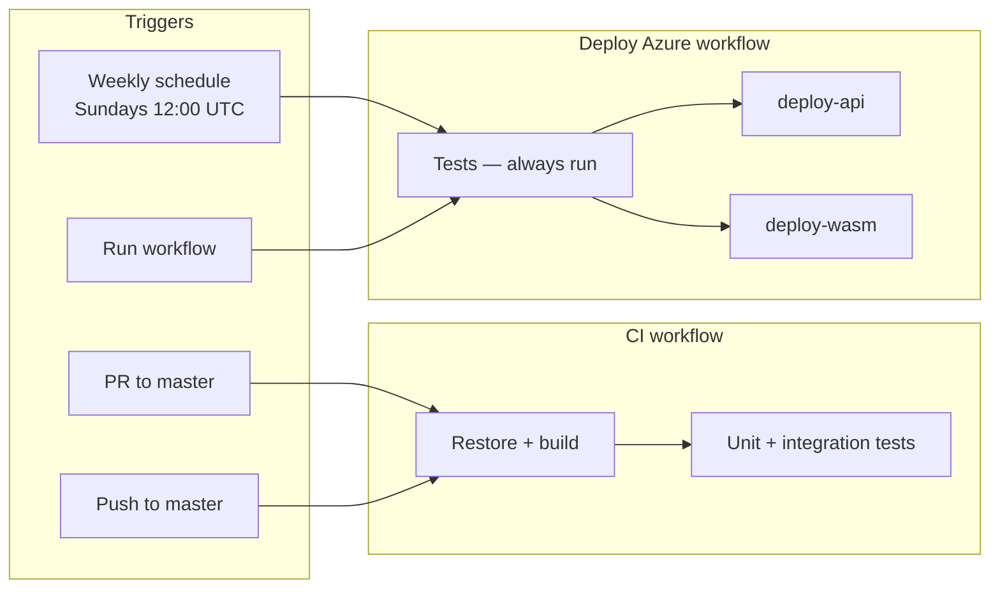

# GitHub Actions (CI/CD)

Automated build, test, and deploy to **`rg-karaokelist`** (`karaokelist` prefix).

| Resource | Name | URL (yours) |
|----------|------|-------------|
| API App Service | `api-karaokelist` | `https://api-karaokelist.azurewebsites.net` |
| Static Web App | `stapp-karaokelist` | `https://karaoke.johnprideaux.net` (custom domain) |
| SQL server | `sql-karaokelist` | (private; API connects via Bicep connection string) |

Provision Azure once with [azure-deployment.md](azure-deployment.md) before the deploy workflow runs. The pipeline deploys **applications only** — not Bicep.

## How it works

CI and CD are **decoupled**: every merge to `master` runs tests, but production deploys only on the **weekly schedule** or when you **Run workflow** manually.



### Deploy targets

| Trigger | `deploy-api` | `deploy-wasm` |
|---|---|---|
| Weekly schedule | yes | yes |
| Manual — `both` (default) | yes | yes |
| Manual — `api` | yes | no |
| Manual — `wasm` | no | yes |
| Push to `master` | no — CI only | no — CI only |

Both deploy jobs always wait for the `test` job to pass first.

### What the pipeline does *not* touch

| Item | Where you set it |
|------|------------------|
| `Jwt__Key` | API App Service → Configuration |
| `Security__Registration__InviteCode` | API App Service → Configuration |
| `Security__Registration__AllowRegistration` | API App Service → Configuration |
| SQL password / Bicep | One-time `infra/main.bicep` deploy |
| Catalog seed | `scripts/seed-catalog.sql` after first API start |

`deploy-api` sets `Cors__Origins__0` to `WASM_PUBLIC_ORIGIN` (currently `https://karaoke.johnprideaux.net`) and restarts the API. This only happens when the API is actually redeployed.

## Workflows

| File | Trigger | Purpose |
|------|---------|---------|
| `.github/workflows/ci.yml` | PR + push to `master` | Build + all test projects |
| `.github/workflows/deploy-azure.yml` | Weekly schedule (Sundays 12:00 UTC), manual | Test → deploy API and/or WASM → smoke test |

Integration tests use `[SkippableFact]` and **skip** on `ubuntu-latest` when LocalDB is unavailable. Unit tests must pass for deploy to proceed.

### Deploy workflow jobs

| Job | Runs when | What it does |
|-----|-----------|--------------|
| `test` | Always | Full build + unit + integration tests |
| `deploy-api` | Weekly schedule, or manual with `api` / `both` | EF `database update` → publish + zip → `az webapp deploy` → CORS sync → smoke test |
| `deploy-wasm` | Weekly schedule, or manual with `wasm` / `both` | Patch `ApiBaseUrl` → `dotnet publish` → `swa deploy` → smoke test |

The deploy job uses GitHub environment **`production`**. That affects the OIDC token subject (see setup below).

---

## One-time setup (≈10 minutes)

### Step 1 — API secrets in Azure (you already did most of this)

On **`api-karaokelist`** → **Environment variables**:

| Setting | Example / notes |
|---------|-----------------|
| `Jwt__Key` | 32+ random chars (not the dev key in repo) |
| `Security__Registration__InviteCode` | Share only with friends |
| `Security__Registration__AllowRegistration` | `true` until everyone has joined |
| `Cors__Origins__0` | `https://karaoke.johnprideaux.net` (also set by deploy workflow) |

The pipeline refreshes CORS after each deploy and restarts the API so login works immediately.

### Step 2 — Azure OIDC for GitHub (automated script)

From repo root, with `az login` and access to the subscription:

```powershell
.\scripts\setup-github-oidc.ps1
```

Defaults: `rg-karaokelist`, repo `jpridx/KaraokeList`.

The script:

1. Creates (or reuses) app registration `github-karaokelist-deploy`
2. Adds **two** federated credentials:
   - `repo:jpridx/KaraokeList:environment:production` — **required** for `deploy-azure.yml`
   - `repo:jpridx/KaraokeList:ref:refs/heads/master` — optional extra
3. Assigns **Contributor** on `rg-karaokelist`
4. Prints the three Azure IDs to paste into GitHub

Re-run safely; it skips existing credentials and role assignments.

Optional — set Azure secrets via GitHub CLI after `gh auth login`:

```powershell
.\scripts\setup-github-oidc.ps1 -SetGitHubSecrets
gh secret set SYNCFUSION_KEY   # prompts for value
```

### Step 3 — GitHub repository secrets

**Settings** → **Secrets and variables** → **Actions** → **New repository secret**:

| Secret | Value |
|--------|--------|
| `AZURE_CLIENT_ID` | From script output (`$appId`) |
| `AZURE_TENANT_ID` | From script output |
| `AZURE_SUBSCRIPTION_ID` | From script output |
| `SYNCFUSION_KEY` | Your Syncfusion license key (WASM publish only) |

### Step 4 — Push workflows

Commit and push `.github/workflows/` to `master`. That triggers **CI** only (tests). Production deploys on the weekly schedule or when you run **Deploy Azure** manually.

Or trigger the first deploy manually: **Actions** → **Deploy Azure** → **Run workflow**.

### Step 5 — Verify first deploy

In the workflow run, check the **Deployment summary** step for URLs. Then:

| Check | Expected |
|-------|----------|
| `GET .../api/auth/me` | **401** |
| Open SWA URL | Login page |
| Register with invite | JWT issued; My Songs / Log work |

On first API start, EF Core runs `MigrateAsync()`. Seed catalog if the grid is empty: `scripts/seed-catalog.sql`.

---

## Manual deploy (without waiting for schedule)

**Actions** → **Deploy Azure** → **Run workflow** → branch `master` → choose **deploy target** (`both`, `api`, or `wasm`).

Same pipeline steps as a scheduled deploy. Use **`both`** after WASM-only manual deploys if API CORS may be out of sync (see troubleshooting).

## Optional: approval gate

`deploy-azure.yml` references environment **`production`**. To require approval before deploy:

1. **Settings** → **Environments** → **production** (created automatically on first run)
2. Enable **Required reviewers**

OIDC must include the `environment:production` federated credential (the setup script adds this).

## Changing resource names

Edit `AZURE_RESOURCE_GROUP`, `AZURE_BASE_NAME`, or `WASM_PUBLIC_ORIGIN` in `.github/workflows/deploy-azure.yml`. Re-run `setup-github-oidc.ps1` if the resource group changes.

## Troubleshooting

| Symptom | Fix |
|---------|-----|
| `AADSTS700213` / federated credential mismatch | Re-run `setup-github-oidc.ps1`; deploy uses `environment:production`, not just `refs/heads/master` |
| `AuthorizationFailed` on `az webapp deploy` | Service principal needs **Contributor** on `rg-karaokelist` |
| WASM publish fails on Syncfusion | Set `SYNCFUSION_KEY` secret |
| API smoke test not 401 | Cold start: first request can take minutes (SQL wake-up). Re-run deploy; check `az webapp log startup show` and `GET /api/version` |
| Deploy API `Timeout reached while tracking deployment status` | Zip often succeeded; site still starting. Workflow uses `--track-status false` + smoke test. Migrations run in CI before deploy — check `/api/version` |
| API Stopped / `SiteStartupCancelled` | Pending migration or restart during startup. Apply migrations manually per [azure-deployment.md](azure-deployment.md#production-schema-migrations-breaking-changes), then `az webapp restart` once |
| `Failed to resolve action download info` / `Service Unavailable` on **Set up job** | Transient GitHub Actions outage — **Re-run all jobs** on the failed workflow (no code change needed) |
| WASM loads, API calls fail | CORS is only synced by `deploy-api`. If you deployed WASM only, confirm `Cors__Origins__0` on the App Service matches `WASM_PUBLIC_ORIGIN` in `deploy-azure.yml`. If they're out of sync, trigger a manual `workflow_dispatch` to redeploy both. |
| Login works, empty catalog | Run `scripts/seed-catalog.sql` against Azure SQL |

## Related docs

| Doc | Topic |
|-----|--------|
| [azure-deployment.md](azure-deployment.md) | Bicep, first-time Azure setup |
| [deployment-roadmap.md](deployment-roadmap.md) | Key Vault, phased checklist |
